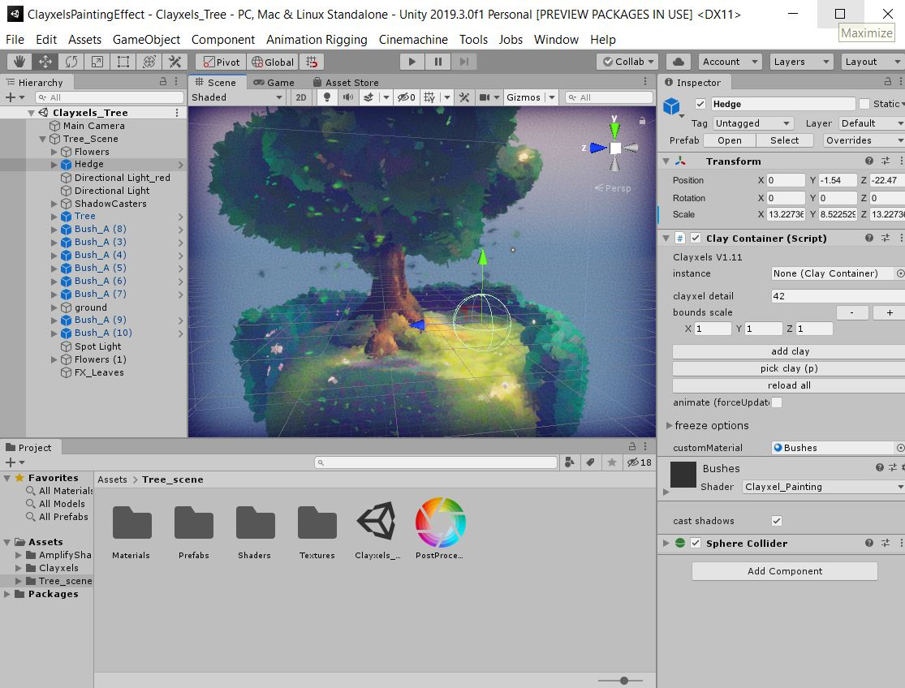

# ClayxelsPaintingEffect

### Requires Clayxels 

NOTE : -after importing clayxels in your project, Right Click>Reimport the Tree_Scene project folder, it will fix some reference issues
-There seems to be compatibility issue with Unity 2019.4.  I only test this project on 2019.3 where it seems to work fine, i will try to fix this 

This project contains a scene that uses Clayxels, and a custom shader made with Amplify Shader Editor. This is by no mean a realtime friendly solution, this was a fun artistic experiment, but if you want to play with it !

I only included one scene (the one with the tree), but all the art i did used the same shader. You should be able to open the shader if you have Amplify Editor, but i have some issue opening it. Check the breakdown here to understand how the shader was made 

You need to have Clayxels in the project for this to work, you can purchase clayxels here :  https://assetstore.unity.com/packages/templates/systems/clayxels-165312?aid=1101leP5L

## You can check all the details about this project, including a detailed breakdown here : https://twitter.com/i/events/1299806787156221952
